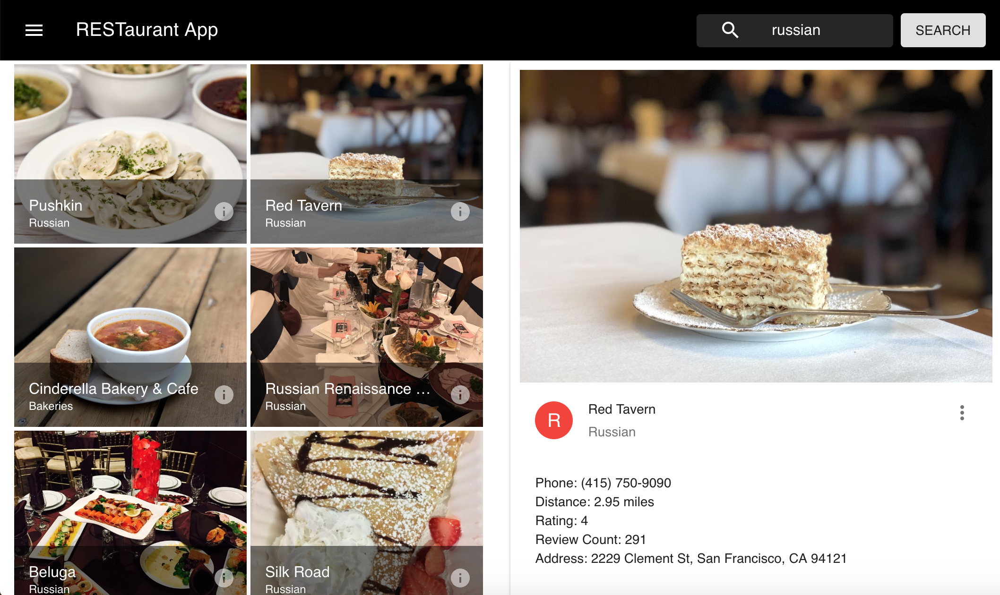

## How to use

1. Clone repository
2. npm install in root
3. npm install in /client
4. You will need to create a .config file in the root of the project, and place this code in it with your own API keys:

module.exports = {
    yelpKey: 'APIKEY',
    googleKey: 'APIKEY'
}

5. How to get Yelp API key: Go their website and set up an account, and you will get an API key https://www.yelp.com/fusion

6. How to get Google Direction API key: Go to their website and set up an account, and enable Directions API. THIS API COSTS MONEY, AT $0.007 per request. But you can get a $300 credit for your first year of use.
https://developers.google.com

7. 'node app.js' in root directory

8. Go into /client and 'npm start'

# What you should see

